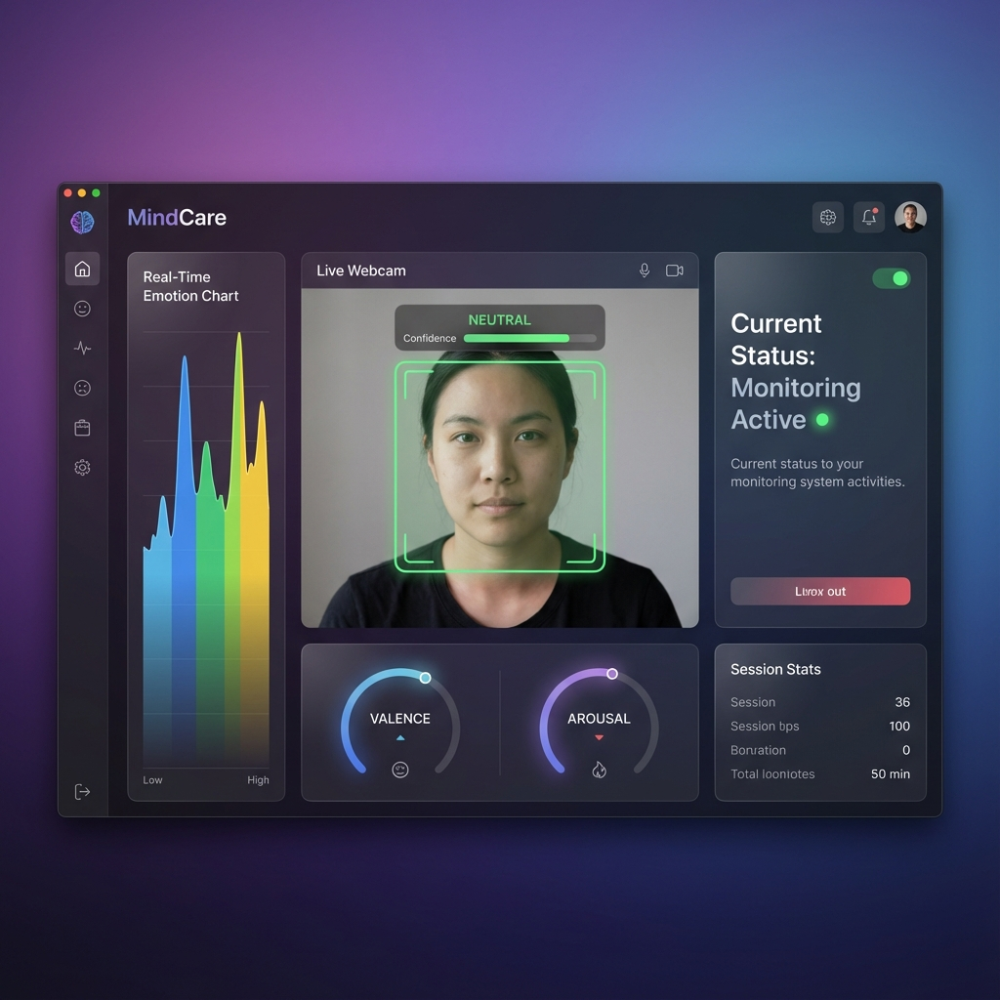
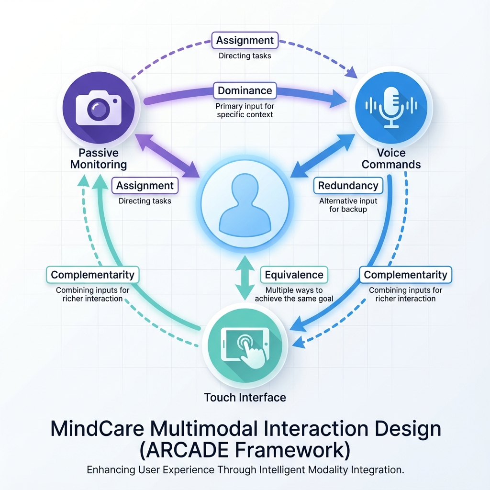
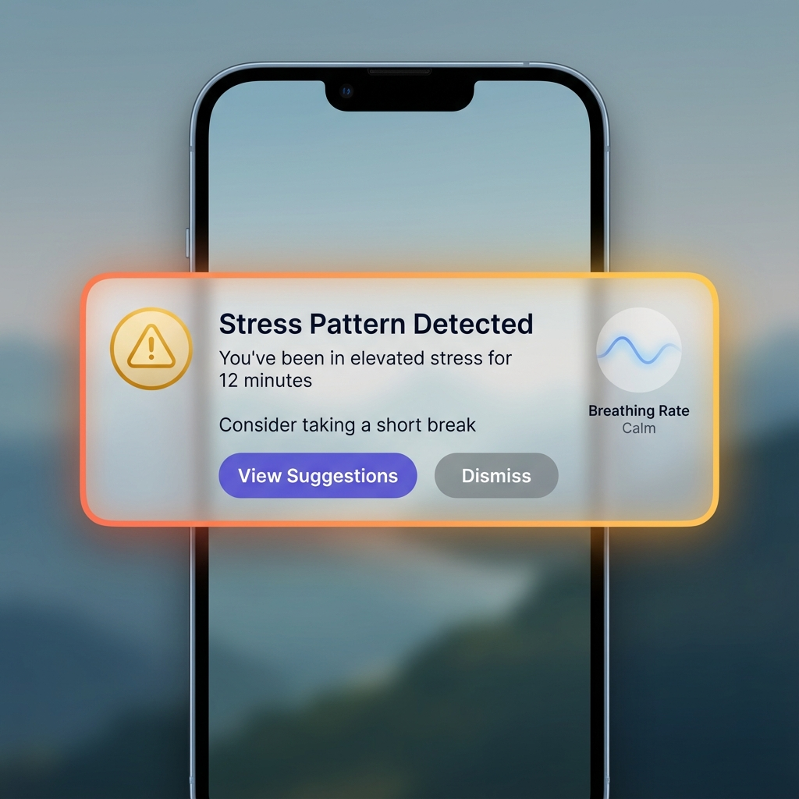
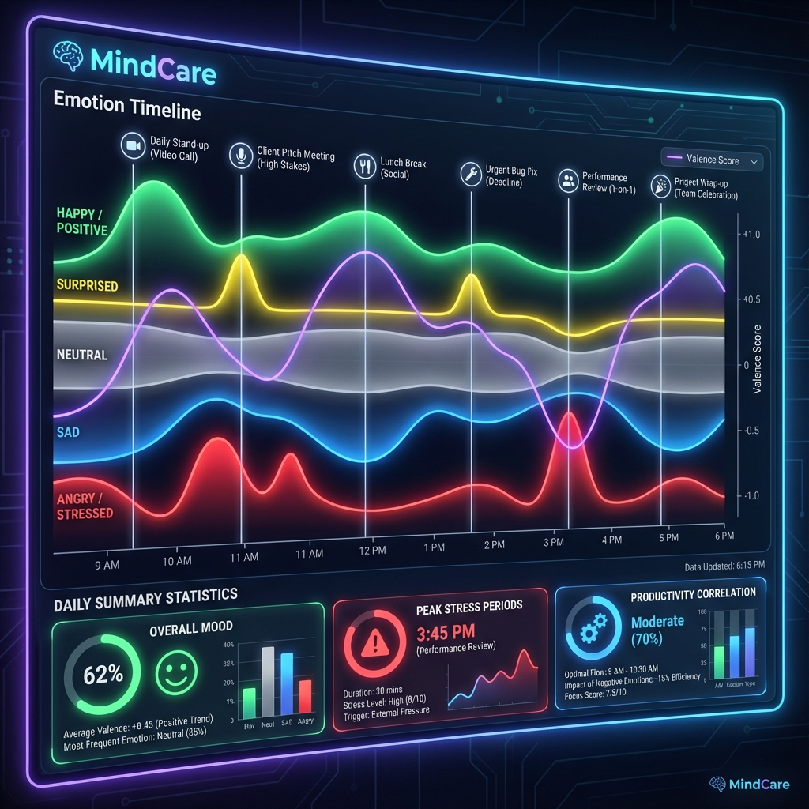
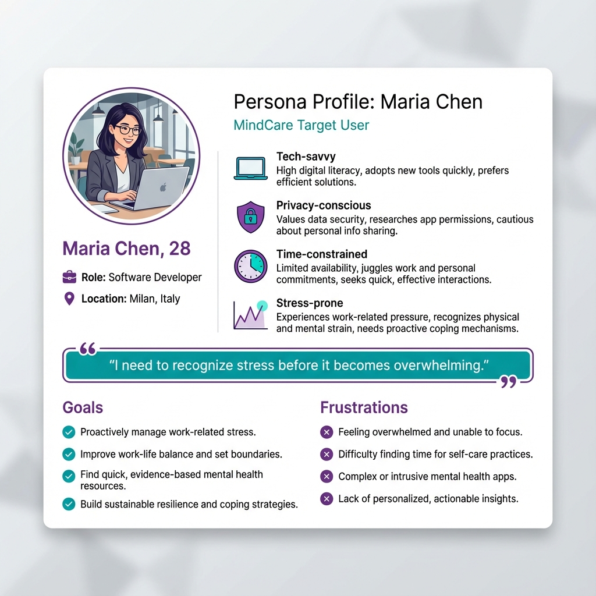

# 🧠 MindCare - Mental Well-being Monitoring System

**Advanced HCI Project ** | University of Trento

<div align="center">


*An intelligent mental well-being monitoring system using facial expression recognition with multimodal interaction*

[](https://www.python.org/downloads/)
[](https://opencv.org/)
[](https://www.tensorflow.org/)
[](LICENSE)

</div>

---

## 📋 Table of Contents

- [Overview](#overview)
- [Features](#features)
- [Project Structure](#project-structure)
- [Installation](#installation)
- [Usage](#usage)
- [Documentation](#documentation)
- [Demo Images](#demo-images)
- [Technical Details](#technical-details)
- [Limitations](#limitations)
- [Author](#author)

---

## 🎯 Overview

MindCare addresses a critical gap in mental health care: **many individuals fail to recognize early warning signs of stress and anxiety**, leading to delayed intervention and deteriorating outcomes.

Our solution combines:
- 🎥 **Passive Facial Expression Recognition** - Non-intrusive monitoring via webcam
- 🎤 **Multimodal Interaction** - Camera, voice, and touch interfaces (ARCADE framework)
- ⏱️ **Real-time Pattern Detection** - Stress alerts based on 15-minute emotion analysis
- 🔒 **Privacy-First Design** - Local processing, no cloud uploads, encrypted storage

---

## ✨ Features

### Implemented (Part III)
- ✅ **Real-time Facial Expression Detection** using OpenCV Haar Cascades
- ✅ **7-Emotion Classification** (happy, sad, angry, fearful, surprised, disgusted, neutral)
- ✅ **Time-Window Processing** - 2-second sliding windows for smooth predictions
- ✅ **Stress Pattern Detection** - Analyzes last 15 minutes every 30 seconds
- ✅ **FSM State Management** - 19 states with comprehensive error handling
- ✅ **Session Analytics** - Emotion distribution, valence scores, statistics

### Documented (Parts I & II)
- 📚 Critical literature review (FER + multimodal affective computing)
- 👤 User-centered design (Persona: Maria Chen, software developer)
- 🎨 Complete system architecture (UML Component + State Chart diagrams)
- 🔧 Technical specifications (hardware, software, functionality)

---

## 📁 Project Structure

```
Advanced HCI/
│
├── 📄 Documentation (Part I & II)
│   ├── final_report.md              # Complete 12-page project report
│   ├── part1_problem_solution.md    # Problem, solution, ARCADE framework
│   ├── literature_review.md         # Critical analysis of research
│   ├── part2_user_design.md         # Persona, scenario, stakeholders
│   ├── system_design.md             # Architecture, UML, specs
│   └── demo_script.md               # 3-minute video demonstration guide
│
├── 💻 Implementation (Part III)
│   ├── src/
│   │   ├── main.py                  # Main application controller (~300 lines)
│   │   ├── config.py                # Configuration management
│   │   ├── face_detector.py         # Face detection with OpenCV (~150 lines)
│   │   └── emotion_classifier.py    # CNN emotion + time windows (~180 lines)
│   ├── part3_behavioral_model.md    # FSM specification (19 states)
│   └── requirements.txt             # Python dependencies
│
├── 🎨 Demo Assets
│   └── demo_images/                 # 6 professional UI mockups
│
├── 📊 Data (created at runtime)
│   ├── models/                      # Pre-trained emotion models (user adds)
│   └── logs/                        # Emotion logs
│
└── README.md                        # This file
```

**Total**: ~3,000 lines documentation + ~500 lines code

---

## 🚀 Installation

### Prerequisites
- Python 3.8 or higher
- Webcam (720p minimum recommended)
- macOS, Windows 10+, or Ubuntu 20.04+

### Setup

1. **Clone the repository**
   ```bash
   git clone https://github.com/zbw123456/mindcare-hci.git
   cd mindcare-hci
   ```

2. **Create virtual environment**
   ```bash
   python3 -m venv venv
   source venv/bin/activate  # macOS/Linux
   # or
   venv\Scripts\activate     # Windows
   ```

3. **Install dependencies**
   ```bash
   pip install -r requirements.txt
   ```

4. **Download emotion model** (optional but recommended)
   - **Option 1**: Download pre-trained FER+ model from [face_classification](https://github.com/oarriaga/face_classification)
   - **Option 2**: Train your own on FER-2013 dataset
   - Place model at: `data/models/emotion_model.h5`

   ⚠️ **Note**: The included demo model is untrained and gives random predictions

---

## 💡 Usage

### Quick Start

```bash
cd src
python main.py
```

### Controls
- `q` - Quit application
- `p` - Pause/Resume monitoring

### Expected Output

```
MindCare v1.0.0
Initializing...
✓ Initialization complete
✓ Camera found and accessible

==================================================
MONITORING STARTED
==================================================

[14:23:15] Emotion: NEUTRAL    | Confidence: 0.78 | Valence: +0.02
[14:23:16] Emotion: HAPPY      | Confidence: 0.65 | Valence: +0.52
...

⚠️  STRESS PATTERN DETECTED
   Negative emotions: 65.0% over last 20 readings
   Suggestion: Consider taking a short break

==================================================
SESSION SUMMARY
==================================================
Emotion Distribution:
  neutral   : ████████████ 60.0% (12)
  happy     : ████ 20.0% (4)
  sad       : ██ 10.0% (2)
  ...
```

---

## 📚 Documentation

### Part I: Problem & Solution
- **Problem**: Lack of early stress/anxiety detection awareness
- **Solution**: MindCare with multimodal interaction (ARCADE framework)
- **Analysis**: 3 pros, 3 cons, comprehensive literature review
- **Files**: [`part1_problem_solution.md`](part1_problem_solution.md), [`literature_review.md`](literature_review.md)

### Part II: User Analysis & Design
- **Persona**: Maria Chen, 28, software developer experiencing workplace stress
- **Scenario**: Day-in-the-life showing system usage and stress detection
- **Stakeholders**: 8 groups mapped with conflicting interests analyzed
- **Architecture**: UML Component Diagram (4-layer), technical specifications
- **Files**: [`part2_user_design.md`](part2_user_design.md), [`system_design.md`](system_design.md)

### Part III: Implementation
- **FSM**: 19 states with error management (UML State Chart)
- **Code**: 4 Python modules implementing real-time FER with time-window processing
- **Key Feature**: 2-second sliding windows for emotion aggregation
- **Files**: [`part3_behavioral_model.md`](part3_behavioral_model.md), [`src/`](src/)

### Final Report
- Comprehensive 12-page report integrating all parts
- **File**: [`final_report.md`](final_report.md)

---

## 🎨 Demo Images

Professional UI mockups for presentations:

| Image | Description |
|-------|-------------|
|  | Main application interface |
|  | MindCare branding |
|  | Multimodal interaction design |
|  | Stress pattern notification |
|  | Emotion timeline visualization |
|  | User persona card |

---

## 🔧 Technical Details

### Time-Window Data Processing

**Implementation**:
1. **Frame-level**: 30 fps emotion classification
2. **Buffer**: Circular buffer storing last 60 predictions (2 seconds)
3. **Aggregation**: Weighted average every 30 frames (~1 second)
4. **Output**: Smoothed emotion with timestamp

**Benefits**:
- Reduces single-frame noise
- Privacy-preserving (no frame storage)
- Computationally efficient

### Multimodal Interaction (ARCADE)

- **Assignment**: Camera (passive), Voice (queries), Touch (config)
- **Redundancy**: Status checks via voice OR touch
- **Complementarity**: Camera (objective) + Voice (context) + Touch (visualization)
- **Dominance**: Context-aware modal switching
- **Equivalence**: Key functions accessible via multiple modalities

### Technology Stack

- **Language**: Python 3.8+
- **Computer Vision**: OpenCV 4.8+ (Haar Cascade face detection)
- **Deep Learning**: TensorFlow 2.14+ (CNN emotion classification)
- **UI**: PyQt5 5.15+ (planned), Console (implemented)
- **Data**: SQLite3, AES-256 encryption
- **Architecture**: MVC pattern with FSM state management

---

## ⚠️ Limitations

1. **Demo Model**: Included CNN is untrained - download real model for actual use
2. **Single Modality Active**: Currently only camera input is functional
3. **Console UI**: No graphical interface (OpenCV window + terminal only)
4. **No Persistence**: Emotion history is in-memory only
5. **Accuracy**: Real-world FER accuracy (~70%) is lower than lab benchmarks

**Important**: This is a prototype for educational purposes. **NOT** a replacement for professional mental health services.

---

## 👨‍💻 Author

**Advanced HCI Project**  
University of Trento

**Student**: Bowen Zhang  
**Course**: Advanced Human-Computer Interaction  
**Topic**: Mental Well-being Technology Solution

---

## 📄 License

Educational project - not for commercial use.

---

## 🙏 Acknowledgments

- Face_1.pdf reference material on Facial Expression Recognition
- Research literature on FER and multimodal affective computing
- OpenCV and TensorFlow communities
- Course instructors and peers for feedback

---

<div align="center">

**⚠️ Disclaimer**: This system should not be used as a medical diagnostic tool. If experiencing mental health issues, please consult qualified healthcare professionals.

Made with 💜 for mental well-being awareness

</div>
