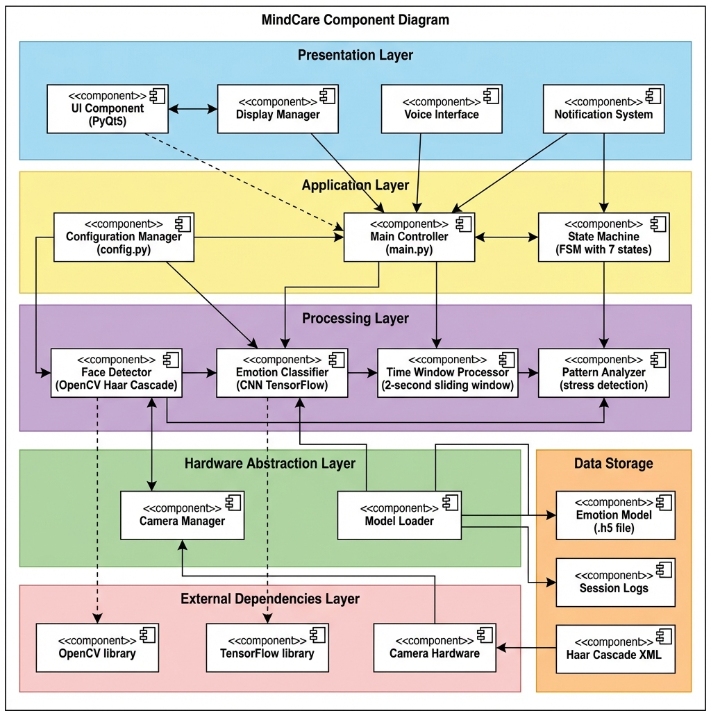
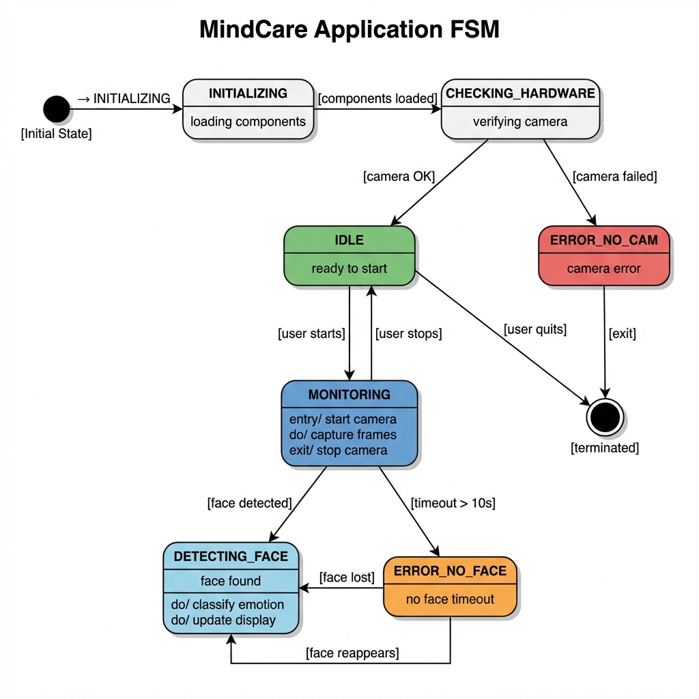
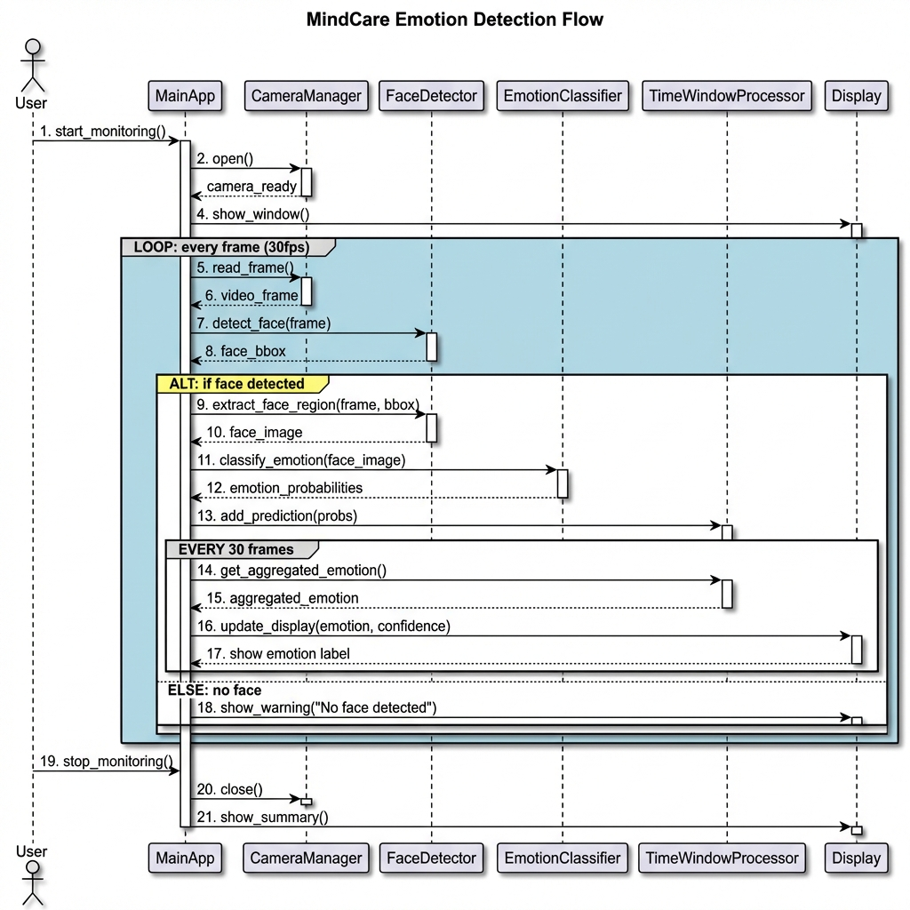
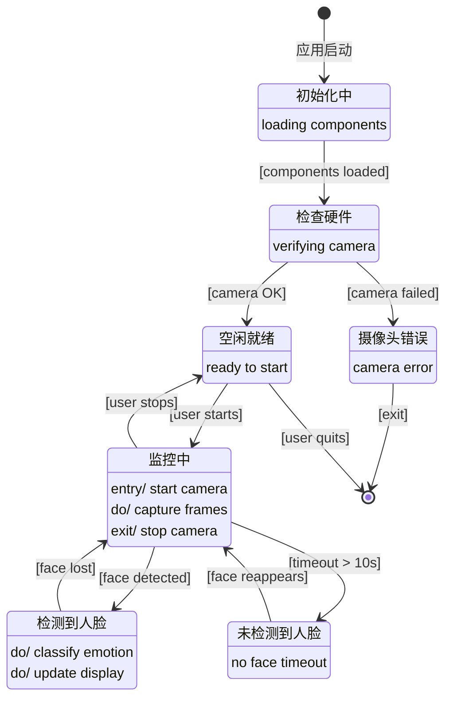
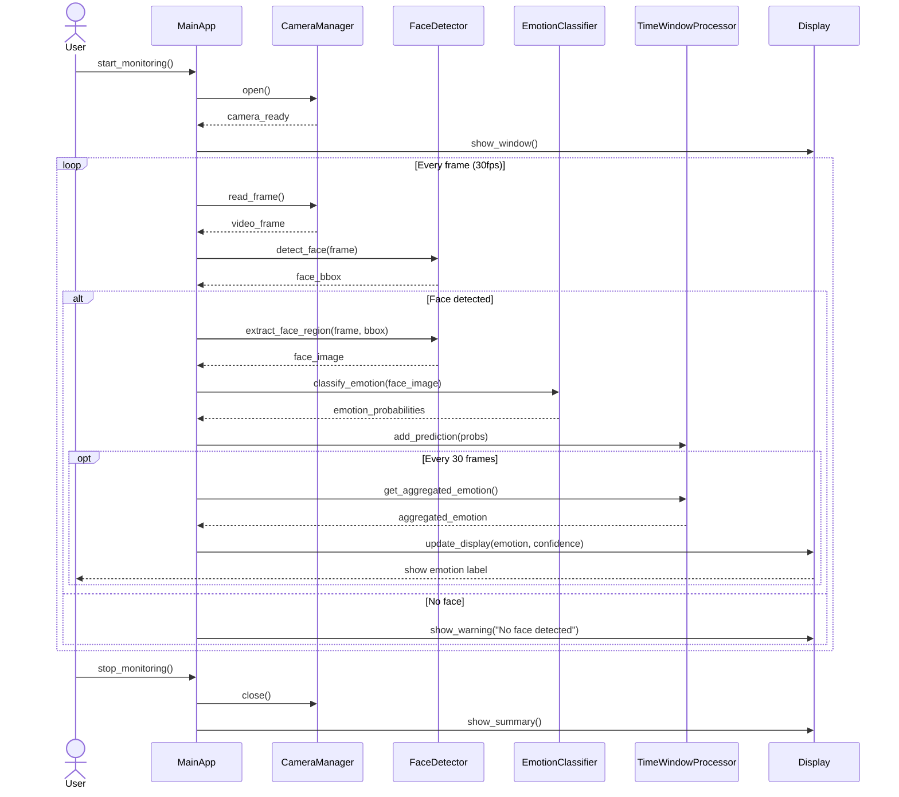

# MindCare - Complete UML Diagram Collection

**Advanced HCI Project 2025-2026**  
University of Trento

---

## 📋 目录 (Table of Contents)

1. [UML组件图 (Component Diagram)](#1-uml组件图-component-diagram)
2. [UML状态图 (State Chart Diagram)](#2-uml状态图-state-chart-diagram)
3. [UML时序图 (Sequence Diagram)](#3-uml时序图-sequence-diagram)
4. [使用说明 (Usage Guide)](#4-使用说明-usage-guide)

---

## 1. UML组件图 (Component Diagram)

### 概述 (Overview)

组件图展示了MindCare系统的**分层架构**,包含6个主要层次和各组件之间的依赖关系。

### 系统架构层次



### 层次说明

#### 🎨 表示层 (Presentation Layer)
负责用户交互和信息展示

| 组件 | 职责 | 技术 |
|------|------|------|
| **UI Component** | 图形用户界面 | PyQt5 |
| **Display Manager** | 视频帧渲染和标注 | OpenCV |
| **Voice Interface** | 语音命令处理 | SpeechRecognition |
| **Notification System** | 警报和提醒 | 系统通知 |

#### 🎯 应用层 (Application Layer)
协调系统各组件,管理应用逻辑

| 组件 | 职责 | 文件 |
|------|------|------|
| **Main Controller** | 主应用控制器,协调所有组件 | `main.py` |
| **State Machine** | 有限状态机,管理7个应用状态 | `AppState` 枚举 |
| **Configuration Manager** | 配置参数管理 | `config.py` |

#### ⚙️ 处理层 (Processing Layer)
核心算法和数据处理

| 组件 | 职责 | 技术 |
|------|------|------|
| **Face Detector** | 人脸检测 | OpenCV Haar Cascade |
| **Emotion Classifier** | 情绪分类 | CNN (TensorFlow) |
| **Time Window Processor** | 时间窗口聚合 (2秒滑动窗口) | 自定义算法 |
| **Pattern Analyzer** | 压力模式检测 | 规则引擎 |

#### 🔧 硬件抽象层 (Hardware Abstraction Layer)
硬件和模型资源管理

| 组件 | 职责 |
|------|------|
| **Camera Manager** | 摄像头访问和帧捕获 |
| **Model Loader** | 加载预训练模型 |

#### 📦 外部依赖 (External Dependencies)
第三方库和硬件

- **OpenCV**: 计算机视觉库
- **TensorFlow**: 深度学习框架
- **Camera Hardware**: 物理摄像头设备

#### 💾 数据存储 (Data Storage)
数据持久化

- **Emotion Model**: 预训练的情绪识别模型 (.h5)
- **Session Logs**: 会话日志
- **Haar Cascade XML**: 人脸检测级联分类器

---

## 2. UML状态图 (State Chart Diagram)

### 概述 (Overview)

状态图展示了MindCare应用的**有限状态机(FSM)**,包含7个主要状态和状态转换条件。

### 应用状态机



### 状态说明

| 状态 | 描述 | 颜色 | 活动 |
|------|------|------|------|
| **INITIALIZING** | 初始化组件 | 白色 | 加载人脸检测器、情绪分类器 |
| **CHECKING_HARDWARE** | 检查硬件 | 白色 | 验证摄像头可用性 |
| **IDLE** | 空闲就绪 | 绿色 | 等待用户启动监控 |
| **MONITORING** | 监控中 | 蓝色 | entry/ 启动摄像头<br>do/ 捕获帧<br>exit/ 停止摄像头 |
| **DETECTING_FACE** | 检测到人脸 | 浅蓝色 | do/ 分类情绪<br>do/ 更新显示 |
| **ERROR_NO_CAM** | 摄像头错误 | 红色 | 显示错误信息 |
| **ERROR_NO_FACE** | 未检测到人脸 | 橙色 | 显示警告,超时10秒 |

### 状态转换

| 源状态 | 目标状态 | 触发条件 |
|--------|----------|----------|
| [初始状态] | INITIALIZING | 应用启动 |
| INITIALIZING | CHECKING_HARDWARE | [组件加载完成] |
| CHECKING_HARDWARE | IDLE | [摄像头正常] |
| CHECKING_HARDWARE | ERROR_NO_CAM | [摄像头失败] |
| IDLE | MONITORING | [用户启动] |
| MONITORING | DETECTING_FACE | [检测到人脸] |
| MONITORING | ERROR_NO_FACE | [超时 > 10秒] |
| DETECTING_FACE | MONITORING | [人脸丢失] |
| MONITORING | IDLE | [用户停止] |
| ERROR_NO_FACE | MONITORING | [人脸重新出现] |
| ERROR_NO_CAM | [终止状态] | [退出] |
| IDLE | [终止状态] | [用户退出] |

### 状态机特点

✅ **错误恢复**: ERROR_NO_FACE状态可恢复到MONITORING  
✅ **用户控制**: 用户可随时暂停/恢复监控  
✅ **清晰的生命周期**: 从初始化到终止的完整流程  

---

## 3. UML时序图 (Sequence Diagram)

### 概述 (Overview)

时序图展示了**情绪检测流程**的完整交互序列,从用户启动到停止监控的全过程。

### 情绪检测流程



### 交互序列详解

#### 阶段1: 初始化 (Initialization)
```
1. User → MainApp: start_monitoring()
2. MainApp → CameraManager: open()
3. CameraManager → MainApp: camera_ready
4. MainApp → Display: show_window()
```

#### 阶段2: 主循环 (Main Loop - 30fps)
```
LOOP: 每帧
  5. MainApp → CameraManager: read_frame()
  6. CameraManager → MainApp: video_frame
  7. MainApp → FaceDetector: detect_face(frame)
  8. FaceDetector → MainApp: face_bbox
  
  ALT: 如果检测到人脸
    9. MainApp → FaceDetector: extract_face_region(frame, bbox)
    10. FaceDetector → MainApp: face_image
    11. MainApp → EmotionClassifier: classify_emotion(face_image)
    12. EmotionClassifier → MainApp: emotion_probabilities
    13. MainApp → TimeWindowProcessor: add_prediction(probs)
    
    EVERY 30帧 (~1秒)
      14. MainApp → TimeWindowProcessor: get_aggregated_emotion()
      15. TimeWindowProcessor → MainApp: aggregated_emotion
      16. MainApp → Display: update_display(emotion, confidence)
      17. Display → User: show emotion label
  
  ELSE: 未检测到人脸
    18. MainApp → Display: show_warning("No face detected")
  
END LOOP
```

#### 阶段3: 清理 (Cleanup)
```
19. User → MainApp: stop_monitoring()
20. MainApp → CameraManager: close()
21. MainApp → Display: show_summary()
```

### 关键时间点

| 操作 | 频率 | 延迟 |
|------|------|------|
| 帧捕获 | 30 fps | ~33ms/帧 |
| 人脸检测 | 每帧 | ~10-20ms |
| 情绪分类 | 每帧 (有人脸时) | ~50-100ms |
| 聚合更新 | 每30帧 (~1秒) | - |
| 显示刷新 | 每帧 | ~5ms |

### 性能指标

- **总延迟**: < 150ms (从捕获到显示)
- **帧率**: 30 fps
- **CPU使用率**: 20-40% (无GPU加速)
- **内存占用**: ~500MB

---

## 4. 使用说明 (Usage Guide)

### 如何使用这些图表

#### 📊 用于项目文档
将图片嵌入到你的报告或演示文稿中:

```markdown

```

#### 🎓 用于演示
- **组件图**: 解释系统架构和模块划分
- **状态图**: 说明应用行为和错误处理
- **时序图**: 展示实时处理流程

#### 📝 用于代码开发
- 参考组件图确定模块职责
- 参考状态图实现状态转换逻辑
- 参考时序图理解方法调用顺序

### 图表文件位置

所有UML图表保存在:
```
/Users/bzhang/Downloads/Advanced HCI/uml_diagrams/
├── component_diagram.png    # 组件图
├── state_diagram.png         # 状态图
└── sequence_diagram.png      # 时序图
```

### 导出为其他格式

#### 转换为PDF (推荐用于打印)
```bash
# 使用ImageMagick
convert component_diagram.png component_diagram.pdf
```

#### 转换为SVG (矢量图,可缩放)
```bash
# 使用在线工具或Inkscape
# https://convertio.co/png-svg/
```

#### 插入到PowerPoint
1. 打开PowerPoint
2. 插入 → 图片 → 选择PNG文件
3. 调整大小和位置

#### 插入到LaTeX
```latex
\begin{figure}[h]
  \centering
  \includegraphics[width=0.8\textwidth]{uml_diagrams/component_diagram.png}
  \caption{MindCare Component Diagram}
  \label{fig:component}
\end{figure}
```

---

## 附录: Mermaid源代码

如果你需要编辑图表,可以使用以下Mermaid代码:

### 组件图 (Mermaid代码)

详见: [`uml_component_diagram.md`](uml_component_diagram.md)

### 状态图 (Mermaid代码)



### 时序图 (Mermaid代码)



---

## 总结

这套完整的UML图表为MindCare项目提供了:

✅ **清晰的系统架构** - 组件图展示模块化设计  
✅ **明确的行为模型** - 状态图定义应用状态机  
✅ **详细的交互流程** - 时序图说明实时处理  

这些图表可用于:
- 📚 项目文档和报告
- 🎓 课程演示和答辩
- 💻 代码开发参考
- 🔍 系统理解和维护

---

**创建时间**: 2026-01-09  
**作者**: Bowen Zhang  
**项目**: MindCare - Advanced HCI Project
