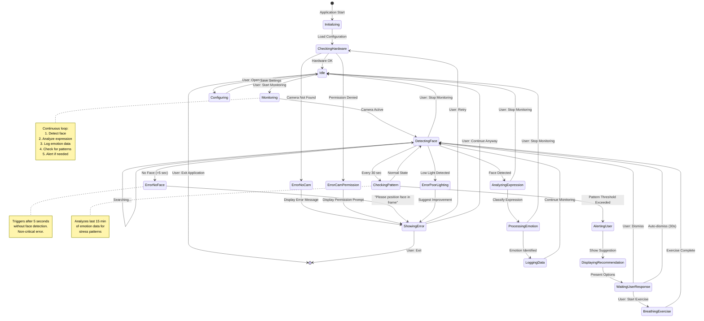

# Part III: Behavioral Model and State Management

## UML State Chart Diagram (Finite State Machine)

The MindCare application follows a finite state machine (FSM) pattern to manage system behavior, user interactions, and error conditions. Below is the state diagram representing the application's lifecycle.



---

## State Descriptions

### **1. Initializing**
**Purpose**: Application startup and resource loading.

**Actions**:
- Load configuration file
- Initialize database connection
- Load pre-trained emotion model into memory
- Set up logging

**Transitions**:
- → `CheckingHardware`: Automatically after initialization complete

**Error Handling**: If model file missing or corrupted, display critical error and exit.

---

### **2. CheckingHardware**
**Purpose**: Verify camera availability and permissions.

**Actions**:
- Enumerate available cameras
- Request camera permissions (if needed)
- Test camera connection

**Transitions**:
- → `Idle`: Camera found and accessible
- → `ErrorNoCam`: No camera detected
- → `ErrorCamPermission`: User denied camera permission

**Timeout**: 5 seconds for hardware check

---

### **3. Idle**
**Purpose**: Ready state waiting for user action.

**UI Display**: 
- "Ready to monitor" message
- Buttons: Start Monitoring, Settings, View History, Exit

**Transitions**:
- → `Monitoring`: User clicks "Start Monitoring"
- → `Configuring`: User clicks "Settings"
- → `[Exit]`: User closes application

**Background Activity**: None (minimal CPU usage)

---

### **4. Monitoring**
**Purpose**: Active monitoring mode.

**Actions**:
- Activate camera
- Set monitoring start timestamp
- Initialize emotion buffer for time-window processing

**Transitions**:
- → `DetectingFace`: Automatically

**UI Update**: Status indicator shows "Monitoring Active" (green)

---

### **5. DetectingFace**
**Purpose**: Continuously search for face in video frames.

**Actions** (every frame, ~30fps):
- Capture frame from camera
- Run face detection algorithm
- If face found: extract face region → goto `AnalyzingExpression`
- If no face: increment no-face counter

**Transitions**:
- → `AnalyzingExpression`: Face detected
- → `ErrorNoFace`: No face detected for >5 seconds (150 frames)
- → `CheckingPattern`: Every 30 seconds (background check)
- → `Idle`: User clicks "Stop Monitoring"

**Error Handling**: Gracefully handle camera disconnection → `ErrorNoCam`

---

### **6. AnalyzingExpression**
**Purpose**: Classify detected facial expression.

**Actions**:
- Preprocess face image (resize, normalize)
- Feed to CNN emotion classifier
- Get probability distribution over emotions
- Select emotion with highest confidence

**Processing Time**: < 100ms per frame

**Transitions**:
- → `ProcessingEmotion`: Emotion classified
- → `DetectingFace`: If face lost during processing

**Data Generated**: 
```python
{
    "timestamp": "2025-12-28T14:32:15.234Z",
    "emotion": "neutral",
    "confidence": 0.78,
    "probabilities": {
        "happy": 0.05,
        "sad": 0.12,
        "angry": 0.03,
        "fearful": 0.02,
        "surprised": 0.00,
        "disgusted": 0.00,
        "neutral": 0.78
    }
}
```

---

### **7. ProcessingEmotion**
**Purpose**: Apply time-window aggregation.

**Actions**:
- Add current emotion to sliding window buffer (typically 30 frames = 1 second)
- Calculate aggregated emotion using weighted average or majority voting
- Update real-time UI display with current emotion

**Transitions**:
- → `LoggingData`: Aggregation complete

**Time Window Settings**: 
- Window size: 1-3 seconds (configurable)
- Overlap: 50% (sliding window)

---

### **8. LoggingData**
**Purpose**: Persist emotion data to database.

**Actions**:
- Write aggregated emotion record to SQLite database
- Update in-memory recent history (last 15 minutes)
- Optional: Trigger data backup if configured

**Transitions**:
- → `DetectingFace`: Continue monitoring loop

**Database Schema**:
```sql
CREATE TABLE emotion_logs (
    id INTEGER PRIMARY KEY,
    timestamp DATETIME,
    emotion TEXT,
    confidence REAL,
    valence REAL,  -- derived: positive/negative score
    arousal REAL   -- derived: energy level
);
```

---

### **9. CheckingPattern**
**Purpose**: Analyze recent emotion history for patterns.

**Trigger**: Every 30 seconds (background task)

**Actions**:
- Retrieve last 15 minutes of emotion logs
- Calculate stress score: `(sad + angry + fearful) / total emotions`
- Compare to user baseline
- Check for sustained stress (>60% negative for >10 min)

**Transitions**:
- → `DetectingFace`: No pattern detected (normal state)
- → `AlertingUser`: Stress threshold exceeded

**Pattern Detection Rules**:
- **Acute Stress**: >60% negative emotions in last 15 min + no break detected
- **Chronic Pattern**: Elevated stress for 3+ consecutive days
- **Declining Trend**: Stress increasing week-over-week

---

### **10. AlertingUser**
**Purpose**: Notify user of detected stress pattern.

**Actions**:
- Generate appropriate notification message
- Determine alert level (Low / Medium / High)
- Show desktop notification

**Transitions**:
- → `DisplayingRecommendation`: Automatically

**UI Notification Example**:
```
⚠️ MindCare Alert
You've been in elevated stress for 12 minutes.
Consider taking a short break?
[View Suggestions] [Dismiss]
```

---

### **11. DisplayingRecommendation**
**Purpose**: Provide actionable suggestions.

**Actions**:
- Run recommendation engine based on:
  - Current stress level
  - Time of day
  - User history (what helped before)
- Display 2-3 recommendations

**Example Recommendations**:
- "Take a 5-minute walk outside"
- "Try a 2-minute breathing exercise"
- "Drink water and have a snack"

**Transitions**:
- → `WaitingUserResponse`: Automatically

---

### **12. WaitingUserResponse**
**Purpose**: Wait for user to interact with recommendation.

**Actions**: Display interactive UI with options

**Transitions**:
- → `DetectingFace`: User dismisses alert
- → `BreathingExercise`: User starts guided exercise
- → `DetectingFace`: Auto-dismiss after 30 seconds (avoid annoyance)

**User Control**: Always allow quick dismiss

---

### **13. BreathingExercise**
**Purpose**: Guide user through stress-reduction exercise.

**Actions**:
- Display visual breathing guide (expanding/contracting circle)
- Play calming audio cues ("Breathe in... hold... breathe out...")
- Run for 2-3 minutes (configurable)
- Pause emotion monitoring during exercise

**Transitions**:
- → `DetectingFace`: Exercise complete, resume monitoring

**UI**: Full-screen or overlay breathing visualization

---

### **14. Configuring**
**Purpose**: Allow user to adjust settings.

**Configurable Parameters**:
- Monitoring schedule (work hours only, or 24/7)
- Alert sensitivity (conservative / balanced / sensitive)
- Notification frequency limits
- Privacy settings (data retention period, encryption)
- Calibration (set personal baseline)

**Transitions**:
- → `Idle`: Save settings

---

## Error States

### **ErrorNoCam**
**Cause**: No camera detected on system.

**User Message**: "Camera not found. Please connect a webcam and retry."

**Actions**: 
- Display troubleshooting tips
- Offer retry or exit options

**Transitions**:
- → `CheckingHardware`: User clicks Retry
- → `[Exit]`: User exits application

---

### **ErrorCamPermission**
**Cause**: User denied camera permission.

**User Message**: "MindCare needs camera access to detect emotional expressions. Please grant permission in system settings."

**Actions**: 
- Show OS-specific instructions to enable camera permission
- Provide link to system preferences

**Transitions**:
- → `CheckingHardware`: User granted permission and clicks Retry
- → `[Exit]`: User exits without granting permission

---

### **ErrorNoFace**
**Cause**: No face detected for >5 seconds during monitoring.

**User Message**: "Please position your face within the camera frame."

**Actions**:
- Overlay frame outline on video preview to guide user
- Continue attempting detection (non-critical error)

**Transitions**:
- → `DetectingFace`: Face detected again
- → `Idle`: User stops monitoring

**Note**: This is a recoverable error; monitoring continues in background.

---

### **ErrorPoorLighting**
**Cause**: Low-light conditions detected (image too dark for reliable detection).

**User Message**: "Lighting is too low for accurate detection. Please improve lighting or adjust window position."

**Actions**:
- Display brightness indicator
- Suggest turning on room lights or repositioning

**Transitions**:
- → `DetectingFace`: Lighting improved
- → `ShowingError`: Persist if lighting remains poor

---

### **ShowingError**
**Purpose**: Generic error display state.

**Actions**: 
- Show error dialog with description
- Offer remediation actions (Retry / Settings / Exit)

**Transitions**:
- → `CheckingHardware`: User clicks Retry
- → `Idle`: User clicks Continue Anyway (for non-critical errors)
- → `[Exit]`: User exits application

---

## State Transition Table

| Current State | Event | Next State | Action |
|--------------|-------|------------|--------|
| Initializing | Config loaded | CheckingHardware | Initialize camera |
| CheckingHardware | Camera OK | Idle | Enable start button |
| CheckingHardware | No camera | ErrorNoCam | Show error |
| Idle | Start clicked | Monitoring | Activate camera |
| Monitoring | Camera active | DetectingFace | Begin face detection |
| DetectingFace | Face found | AnalyzingExpression | Extract face region |
| DetectingFace | No face (5s) | ErrorNoFace | Display warning |
| AnalyzingExpression | Classified | ProcessingEmotion | Apply time window |
| ProcessingEmotion | Aggregated | LoggingData | Write to database |
| LoggingData | Logged | DetectingFace | Continue loop |
| CheckingPattern | Stress detected | AlertingUser | Generate alert |
| AlertingUser | Alert shown | DisplayingRecommendation | Show suggestions |
| WaitingUserResponse | Exercise selected | BreathingExercise | Start guide |
| WaitingUserResponse | Dismissed | DetectingFace | Resume monitoring |
| Any state | Stop clicked | Idle | Release camera |
| Any state | Exit clicked | [Exit] | Cleanup and quit |

---

## Implementation Notes

### FSM Implementation in Python

The state machine will be implemented using an enum-based pattern:

```python
from enum import Enum, auto

class AppState(Enum):
    INITIALIZING = auto()
    CHECKING_HARDWARE = auto()
    IDLE = auto()
    MONITORING = auto()
    DETECTING_FACE = auto()
    ANALYZING_EXPRESSION = auto()
    PROCESSING_EMOTION = auto()
    LOGGING_DATA = auto()
    CHECKING_PATTERN = auto()
    ALERTING_USER = auto()
    DISPLAYING_RECOMMENDATION = auto()
    WAITING_USER_RESPONSE = auto()
    BREATHING_EXERCISE = auto()
    CONFIGURING = auto()
    ERROR_NO_CAM = auto()
    ERROR_CAM_PERMISSION = auto()
    ERROR_NO_FACE = auto()
    ERROR_POOR_LIGHTING = auto()
    SHOWING_ERROR = auto()

class StateManager:
    def __init__(self):
        self.current_state = AppState.INITIALIZING
        self.state_handlers = {
            AppState.INITIALIZING: self.handle_initializing,
            AppState.CHECKING_HARDWARE: self.handle_checking_hardware,
            # ... (handlers for each state)
        }
    
    def transition_to(self, new_state):
        print(f"State transition: {self.current_state} → {new_state}")
        self.current_state = new_state
        self.execute_state()
    
    def execute_state(self):
        handler = self.state_handlers.get(self.current_state)
        if handler:
            handler()
```

This FSM provides clear behavioral specification, graceful error handling, and maintainable state-driven architecture for the MindCare application.
