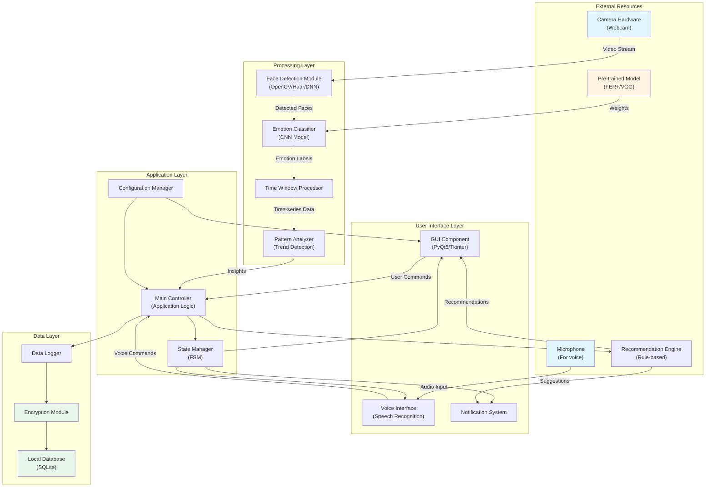

# Part II: System Design and Technical Specifications

## 1. System Architecture - UML Component Diagram

### Component Descriptions

#### **User Interface Layer**
- **GUI Component**: Desktop application interface displaying real-time emotion status, historical trends, settings, and recommendations. Built with PyQt5 for rich UI capabilities.
- **Voice Interface**: Handles voice commands ("Hey MindCare, how am I doing?") using speech recognition libraries.
- **Notification System**: Manages on-screen notifications and alerts for stress detection and recommendations.

#### **Application Layer**
- **Main Controller**: Central orchestrator coordinating all components, handling user requests, and managing application workflow.
- **State Manager**: Implements Finite State Machine (FSM) for application behavior (Idle, Monitoring, Analyzing, Alerting, Error states).
- **Configuration Manager**: Handles user preferences, system settings, privacy controls, and calibration data.

#### **Processing Layer**
- **Face Detection Module**: Uses OpenCV with Haar Cascades or DNN-based face detection to locate faces in video frames.
- **Emotion Classifier**: CNN-based model (transfer learning from VGG16/ResNet) classifying expressions into 7 categories (Happy, Sad, Angry, Fearful, Surprised, Disgusted, Neutral).
- **Time Window Processor**: Aggregates emotion predictions over sliding windows (1-3 seconds) to smooth out momentary fluctuations and reduce noise.
- **Pattern Analyzer**: Detects trends over longer periods (hours, days, weeks) to identify concerning patterns (e.g., sustained stress, declining mood).

#### **Data Layer**
- **Local Database**: SQLite database storing emotion logs, user interactions, settings—all stored locally on user's machine.
- **Data Logger**: Formats and writes emotion data with timestamps.
- **Encryption Module**: AES-256 encryption for sensitive emotional data at rest.

#### **External Resources**
- **Camera Hardware**: Standard webcam (minimum 720p, 30fps).
- **Microphone**: For voice command input (future: vocal affect analysis).
- **Pre-trained Model**: Deep learning model weights (FER+, AffectNet, or custom-trained).
- **Recommendation Engine**: Rule-based system providing contextual suggestions based on detected emotional states and patterns.

---

## 2. Hardware Specifications

### Required Hardware

| Component | Minimum Specification | Recommended Specification |
|-----------|----------------------|---------------------------|
| **Camera** | 720p (1280×720), 30fps, USB 2.0 | 1080p (1920×1080), 60fps, USB 3.0 |
| **Microphone** | Any built-in or USB microphone | Directional USB microphone, 16kHz+ sampling |
| **Processor** | Intel i5 (8th gen) or equivalent, 2.5GHz+ | Intel i7 (10th gen+) or M1/M2 Apple Silicon |
| **RAM** | 8GB | 16GB |
| **Storage** | 5GB free space | 10GB free space (for logs and models) |
| **GPU** | Integrated graphics (CPU inference) | Dedicated GPU with CUDA support (NVIDIA GTX 1050+) for faster processing |
| **Display** | 1280×720 resolution | 1920×1080 or higher |
| **OS** | macOS 11+, Windows 10+, Ubuntu 20.04+ | macOS 13+, Windows 11, Ubuntu 22.04 |

### Camera Requirements Detail
- **Field of View (FOV)**: 60-90 degrees (standard webcam FOV)
- **Focus**: Auto-focus or fixed focus with adequate depth range (50cm - 100cm)
- **Low-light Performance**: Should work in typical indoor office lighting (300-500 lux)
- **Position**: Mounted at eye level or slightly above for natural face angle

---

## 3. Software Tools and Frameworks

### Programming Language
- **Python 3.8+**: Primary development language for rapid prototyping and extensive ML library support

### Core Libraries

#### Computer Vision and Face Detection
- **OpenCV 4.8+** (`opencv-python`): 
  - Face detection using Haar Cascades or DNN module
  - Video stream capture and processing
  - Image preprocessing (grayscale conversion, histogram equalization)
  
#### Deep Learning and Emotion Classification
- **TensorFlow 2.14+** or **PyTorch 2.0+**:
  - Loading pre-trained CNN models
  - Transfer learning from VGG16/ResNet/EfficientNet
  - Inference on video frames
  
- **Keras** (if using TensorFlow backend):
  - High-level API for model definition
  
#### Data Science and Analysis
- **NumPy 1.24+**: Numerical operations and array manipulation
- **Pandas 2.0+**: Time-series data management for emotion logs
- **Scikit-learn 1.3+**: Data preprocessing, potential for supplementary classical ML

#### GUI Development
- **PyQt5 5.15+** or **Tkinter** (built-in):
  - Desktop application interface
  - Real-time visualization with matplotlib/pyqtgraph
  - Custom styling for user-friendly design
  
#### Voice Interaction
- **SpeechRecognition 3.10+**: Speech-to-text for voice commands
- **PyAudio 0.2.13**: Audio stream handling
- **pyttsx3 2.90**: Text-to-speech for voice responses (future feature)

#### Data Storage and Security
- **SQLite3** (built-in Python): Local database for emotion logs
- **cryptography 41.0+**: AES encryption for data at rest

#### Additional Utilities
- **python-dotenv 1.0+**: Environment variable management
- **Pillow 10.0+**: Image handling utilities
- **matplotlib 3.8+** or **Plotly 5.17+**: Data visualization for trends
- **schedule 1.2+**: Task scheduling for periodic checks

### Pre-trained Models (Options)

1. **FER+ Model**: 
   - Source: Microsoft FER+ dataset
   - Architecture: VGG-like CNN
   - Classes: 8 emotions (7 basic + contempt)
   
2. **DeepFace**:
   - Multi-model framework (VGG-Face, Facenet, OpenFace)
   - Built-in emotion detection
   - Easy integration
   
3. **MTCNN + Custom Model**:
   - MTCNN for face detection
   - Custom-trained model on FER-2013 or AffectNet
   
4. **Hugging Face Transformers**:
   - Pre-trained Vision Transformers (ViT) for emotion recognition
   - Available: `nateraw/vit-base-beans` (emotion fine-tuned)

### Development Tools
- **Git**: Version control
- **VS Code** or **PyCharm**: IDE with Python debugging
- **Jupyter Notebooks**: Prototyping and model testing
- **pytest**: Unit testing framework
- **Black** + **Flake8**: Code formatting and linting

### Deployment Considerations
- **PyInstaller 6.0+**: Creating standalone executables for distribution
- **Docker** (optional): Containerization for reproducible environments
- **GitHub Actions**: CI/CD for automated testing

---

## 4. Software Architecture Details

### Design Patterns
- **Model-View-Controller (MVC)**: Separation of data (model), UI (view), and logic (controller)
- **Observer Pattern**: UI components subscribe to state changes
- **Singleton Pattern**: Configuration manager ensures single source of truth for settings
- **State Pattern**: FSM for application behavior management

### Data Flow
1. **Capture**: Camera captures video frames (30fps)
2. **Detection**: Face detector identifies face regions in each frame
3. **Preprocessing**: Crop face, resize to model input size (e.g., 48×48 or 224×224), normalize
4. **Classification**: CNN model predicts emotion probabilities
5. **Aggregation**: Time window processor aggregates last N predictions (e.g., 30 frames = 1 second)
6. **Analysis**: Pattern analyzer compares current state to baseline and historical data
7. **Action**: If threshold crossed, trigger notification or recommendation
8. **Logging**: Store aggregated emotion data (not raw frames) to database
9. **Visualization**: Update GUI with current state and trends

### Privacy and Security Features
- **Local Processing**: All emotion detection runs on-device, no cloud uploads
- **Data Encryption**: AES-256 encryption for stored emotion logs
- **User Control**: 
  - Easy pause/resume monitoring
  - One-click data deletion
  - Export data in portable format (JSON/CSV)
- **No Frame Storage**: Raw video frames are not stored, only emotion classifications
- **Transparency**: Show users exactly what data is collected and how it's used

---

## 5. Functionality Specifications

### Core Functionality (Part III Implementation Focus)

#### **Functionality 1: Real-time Facial Expression Detection**
**Description**: Continuously monitor webcam feed and classify facial expressions into 7 emotion categories.

**Input**: Video stream from webcam (720p, 30fps)

**Processing**:
- Detect face using Haar Cascade or DNN
- Extract face region and preprocess (resize to 48×48 or 224×224, grayscale/RGB based on model)
- Feed to CNN emotion classifier
- Output probability distribution over 7 emotions

**Output**: 
- Primary emotion label (highest probability)
- Confidence score
- Timestamp

**Time Window**: 
- Real-time frame-by-frame detection
- Aggregated over 1-second sliding windows (30 frames)
- Majority voting or weighted averaging for stability

**Performance Target**: 
- Latency: < 100ms per frame
- Accuracy: >70% on real-world expressions (lower than lab datasets)

---

#### **Functionality 2: Stress Pattern Detection**
**Description**: Analyze emotion time-series to detect sustained stress or concerning patterns.

**Input**: Time-series of aggregated emotions (1-second windows)

**Processing**:
- Track proportion of negative emotions (sad, angry, fearful) over 15-minute windows
- Compare to user's personal baseline (established over first week of use)
- Detect:
  - **Acute stress**: >60% negative emotions for >10 minutes
  - **Chronic pattern**: Elevated stress for >3 consecutive days
  - **Declining trend**: Week-over-week increase in stress markers

**Output**:
- Alert level: None / Low / Medium / High
- Pattern description (e.g., "Sustained stress detected since 2:00 PM")
- Contextual timestamp

**Threshold Settings**: User-adjustable sensitivity (conservative / balanced / sensitive)

---

#### **Functionality 3: Intervention Recommendations**
**Description**: Provide contextual, actionable suggestions based on detected emotional state.

**Input**: Current emotional state + pattern analysis + time of day + user history

**Processing** (Rule-based engine):
- **If acute stress + no break in >2 hours** → Suggest break/walk
- **If stress at typical lunch time** → Remind to eat
- **If chronic pattern detected** → Suggest professional help resources
- **If stress decreases after specific action** → Reinforce that action

**Output**:
- Notification with suggestion
- Optional: Guided breathing exercise (visual + audio)
- Links to resources (therapist directories, EAP info)

**Personalization**:
- Learn which suggestions user acts on (vs. dismisses)
- Adapt notification frequency to avoid annoyance

---

### Additional Planned Functionalities (Documented, Partially Implemented)

#### **Functionality 4: Historical Trend Visualization**
- Daily/weekly/monthly emotion distribution charts
- Correlation with calendar events (if user grants calendar access)
- Export data for personal review or sharing with therapist

#### **Functionality 5: Voice Command Interface**
- "Hey MindCare, how am I doing?" → Voice summary of current/recent emotions
- "Pause monitoring" → Easy hands-free control
- Future: Vocal affect analysis (tone, pitch) for multimodal emotion detection

#### **Functionality 6: Privacy Controls**
- Instant monitoring pause (keyboard shortcut + UI button)
- Customizable monitoring schedule (e.g., only during work hours)
- Automatic pause when screen sharing or in video calls (respects meeting privacy)

---

## Summary

This system design provides a technically feasible architecture for the MindCare application, balancing functionality with privacy and user autonomy. The modular component structure allows for iterative development, starting with core emotion detection (Part III implementation) and expanding to full multimodal interaction in future iterations.

Key design principles:
- **Privacy-first**: Local processing, encryption, user control
- **Technically grounded**: Proven technologies (OpenCV, TensorFlow, PyQt) with realistic performance expectations
- **User-centered**: Simple interface, actionable insights, no over-promising
- **Extensible**: Modular architecture supports adding voice analysis, physiological sensors, etc.

The specifications are realistic for a semester project, focusing on one fully-implemented functionality (real-time FER) while documenting the broader vision.
