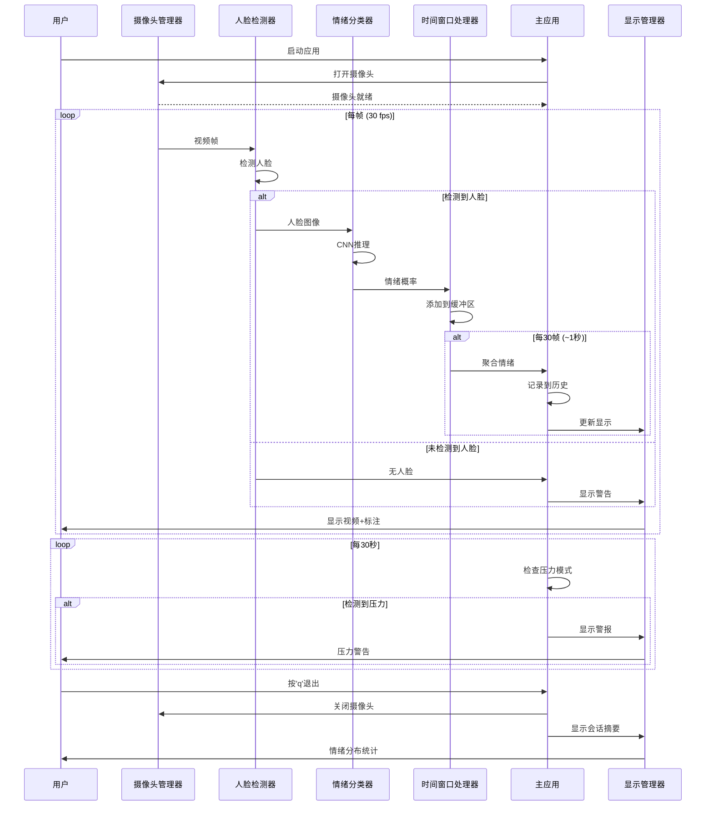
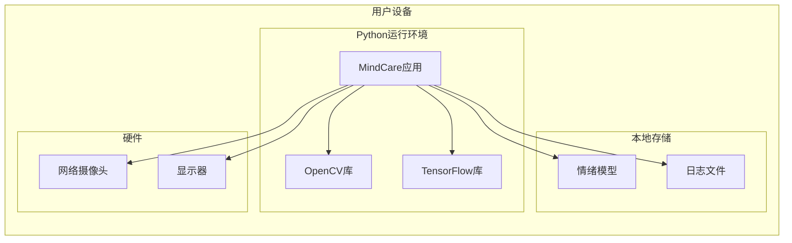
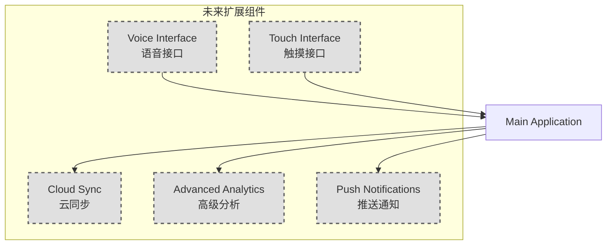

# MindCare - UML Component Diagram

## 系统架构概览

MindCare系统采用分层架构设计,包含四个主要层次:表示层、应用层、处理层和硬件抽象层。

## UML组件图

```mermaid
graph TB
    subgraph "Presentation Layer 表示层"
        UI[UI Component<br/>用户界面组件]
        Display[Display Manager<br/>显示管理器]
    end
    
    subgraph "Application Layer 应用层"
        MainApp[Main Application<br/>主应用控制器<br/>main.py]
        FSM[State Machine<br/>状态机<br/>AppState]
        Config[Configuration<br/>配置管理<br/>config.py]
    end
    
    subgraph "Processing Layer 处理层"
        FaceDetection[Face Detector<br/>人脸检测<br/>face_detector.py]
        EmotionClass[Emotion Classifier<br/>情绪分类器<br/>emotion_classifier.py]
        TimeWindow[Time Window Processor<br/>时间窗口处理器]
        PatternAnalyzer[Pattern Analyzer<br/>模式分析器]
    end
    
    subgraph "Hardware Abstraction Layer 硬件抽象层"
        Camera[Camera Manager<br/>摄像头管理器]
        ModelLoader[Model Loader<br/>模型加载器]
    end
    
    subgraph "External Dependencies 外部依赖"
        OpenCV[OpenCV<br/>计算机视觉库]
        TensorFlow[TensorFlow/Keras<br/>深度学习框架]
        Hardware[Hardware<br/>摄像头硬件]
    end
    
    subgraph "Data Storage 数据存储"
        ModelData[(Emotion Model<br/>情绪识别模型<br/>.h5)]
        LogData[(Session Logs<br/>会话日志)]
        CascadeData[(Haar Cascade<br/>级联分类器)]
    end

    %% Presentation Layer connections
    UI -->|display frames| Display
    Display -->|render| UI
    
    %% Application Layer connections
    MainApp -->|manages| FSM
    MainApp -->|reads| Config
    MainApp -->|controls| FaceDetection
    MainApp -->|controls| EmotionClass
    MainApp -->|controls| TimeWindow
    MainApp -->|analyzes| PatternAnalyzer
    MainApp -->|updates| Display
    
    %% Processing Layer connections
    FaceDetection -->|face bbox| EmotionClass
    EmotionClass -->|predictions| TimeWindow
    TimeWindow -->|aggregated emotions| PatternAnalyzer
    PatternAnalyzer -->|stress alerts| MainApp
    
    %% Hardware Abstraction Layer connections
    FaceDetection -->|uses| Camera
    EmotionClass -->|uses| ModelLoader
    Camera -->|video frames| FaceDetection
    ModelLoader -->|loaded model| EmotionClass
    
    %% External Dependencies connections
    FaceDetection -.->|depends on| OpenCV
    Camera -.->|depends on| OpenCV
    EmotionClass -.->|depends on| TensorFlow
    ModelLoader -.->|depends on| TensorFlow
    Camera -.->|accesses| Hardware
    
    %% Data Storage connections
    ModelLoader -->|loads| ModelData
    FaceDetection -->|loads| CascadeData
    MainApp -->|writes| LogData
    
    %% Styling
    classDef presentation fill:#e1f5ff,stroke:#01579b,stroke-width:2px
    classDef application fill:#fff9c4,stroke:#f57f17,stroke-width:2px
    classDef processing fill:#f3e5f5,stroke:#4a148c,stroke-width:2px
    classDef hardware fill:#e8f5e9,stroke:#1b5e20,stroke-width:2px
    classDef external fill:#fce4ec,stroke:#880e4f,stroke-width:2px
    classDef data fill:#fff3e0,stroke:#e65100,stroke-width:2px
    
    class UI,Display presentation
    class MainApp,FSM,Config application
    class FaceDetection,EmotionClass,TimeWindow,PatternAnalyzer processing
    class Camera,ModelLoader hardware
    class OpenCV,TensorFlow,Hardware external
    class ModelData,LogData,CascadeData data
```



## 组件详细说明

### 1. 表示层 (Presentation Layer)

#### UI Component (用户界面组件)
- **职责**: 处理用户交互,显示实时视频和情绪信息
- **技术**: OpenCV窗口 + 控制台输出
- **接口**: 
  - 输入: 键盘事件 (q=退出, p=暂停)
  - 输出: 视频帧显示,文本信息

#### Display Manager (显示管理器)
- **职责**: 管理视频帧的渲染和标注
- **功能**: 绘制人脸边框,情绪标签,警告信息

---

### 2. 应用层 (Application Layer)

#### Main Application (主应用控制器)
- **文件**: `main.py` - `MindCareApp` 类
- **职责**: 
  - 协调所有组件
  - 实现主监控循环
  - 管理应用生命周期
- **核心方法**:
  - `initialize()`: 初始化所有组件
  - `check_hardware()`: 检查硬件可用性
  - `monitor_loop()`: 主监控循环
  - `check_stress_pattern()`: 压力模式检测

#### State Machine (状态机)
- **实现**: `AppState` 枚举类
- **状态**: 7个状态
  - INITIALIZING (初始化中)
  - CHECKING_HARDWARE (检查硬件)
  - IDLE (空闲)
  - MONITORING (监控中)
  - DETECTING_FACE (检测到人脸)
  - ERROR_NO_CAM (摄像头错误)
  - ERROR_NO_FACE (未检测到人脸)

#### Configuration (配置管理)
- **文件**: `config.py`
- **职责**: 集中管理所有配置参数
- **配置项**:
  - 摄像头参数
  - 模型参数
  - 检测阈值
  - 情绪标签和映射

---

### 3. 处理层 (Processing Layer)

#### Face Detector (人脸检测器)
- **文件**: `face_detector.py` - `FaceDetector` 类
- **职责**: 从视频帧中检测人脸
- **技术**: Haar Cascade 分类器
- **接口**:
  - 输入: BGR图像帧
  - 输出: 人脸边界框 (x, y, w, h)
- **核心方法**:
  - `detect_face()`: 检测最大人脸
  - `extract_face_region()`: 提取人脸区域
  - `draw_face_box()`: 绘制边界框

#### Emotion Classifier (情绪分类器)
- **文件**: `emotion_classifier.py` - `EmotionClassifier` 类
- **职责**: 将人脸图像分类为7种情绪
- **技术**: CNN (卷积神经网络)
- **情绪类别**: happy, sad, angry, fearful, surprised, disgusted, neutral
- **接口**:
  - 输入: 人脸图像 (48x48 灰度)
  - 输出: 情绪概率分布字典
- **核心方法**:
  - `classify_emotion()`: 分类情绪
  - `get_dominant_emotion()`: 获取主导情绪
  - `calculate_valence_arousal()`: 计算效价和唤醒度

#### Time Window Processor (时间窗口处理器)
- **文件**: `emotion_classifier.py` - `TimeWindowProcessor` 类
- **职责**: 在时间窗口内聚合情绪预测
- **技术**: 滑动窗口 (2秒, 60帧)
- **功能**:
  - 平滑单帧噪声
  - 加权平均聚合
  - 多数投票机制
- **核心方法**:
  - `add_prediction()`: 添加预测到缓冲区
  - `get_aggregated_emotion()`: 获取聚合情绪

#### Pattern Analyzer (模式分析器)
- **实现**: `MindCareApp.check_stress_pattern()` 方法
- **职责**: 分析情绪历史,检测压力模式
- **逻辑**:
  - 每30秒检查一次
  - 分析最近15分钟数据
  - 负面情绪比例 > 阈值时触发警报

---

### 4. 硬件抽象层 (Hardware Abstraction Layer)

#### Camera Manager (摄像头管理器)
- **文件**: `face_detector.py` - `CameraManager` 类
- **职责**: 管理摄像头访问和帧捕获
- **功能**:
  - 打开/关闭摄像头
  - 设置摄像头参数 (分辨率, FPS)
  - 读取视频帧
- **核心方法**:
  - `open()`: 打开摄像头连接
  - `read_frame()`: 读取一帧
  - `close()`: 释放资源

#### Model Loader (模型加载器)
- **实现**: `EmotionClassifier.__init__()` 方法
- **职责**: 加载预训练的情绪识别模型
- **支持格式**: Keras .h5 模型
- **回退机制**: 如果模型不存在,创建演示模型

---

### 5. 外部依赖 (External Dependencies)

#### OpenCV
- **用途**: 
  - 人脸检测 (Haar Cascade)
  - 图像处理
  - 视频捕获
  - UI显示

#### TensorFlow/Keras
- **用途**:
  - CNN模型定义
  - 模型训练/加载
  - 情绪分类推理

#### Hardware (硬件)
- **摄像头**: 720p, 30fps 推荐

---

### 6. 数据存储 (Data Storage)

#### Emotion Model (情绪识别模型)
- **路径**: `data/models/emotion_model.h5`
- **格式**: Keras HDF5
- **输入**: 48x48x1 灰度图像
- **输出**: 7维概率向量

#### Haar Cascade (级联分类器)
- **来源**: OpenCV内置
- **文件**: `haarcascade_frontalface_default.xml`

#### Session Logs (会话日志)
- **存储**: 内存 (运行时)
- **内容**: 
  - 时间戳
  - 情绪标签
  - 置信度
  - 效价/唤醒度

---

## 数据流图



---

## 组件间接口定义

### 接口1: IFaceDetector
```python
detect_face(frame: np.ndarray) -> Optional[Tuple[int, int, int, int]]
extract_face_region(frame: np.ndarray, bbox: Tuple, target_size: Tuple) -> np.ndarray
draw_face_box(frame: np.ndarray, bbox: Tuple, label: str, color: Tuple) -> np.ndarray
```

### 接口2: IEmotionClassifier
```python
classify_emotion(face_img: np.ndarray) -> Dict[str, float]
get_dominant_emotion(emotion_probs: Dict[str, float]) -> Tuple[str, float]
calculate_valence_arousal(emotion_probs: Dict[str, float]) -> Tuple[float, float]
```

### 接口3: ITimeWindowProcessor
```python
add_prediction(emotion_probs: Dict[str, float], timestamp: float) -> None
get_aggregated_emotion() -> Optional[Dict[str, float]]
clear() -> None
```

### 接口4: ICameraManager
```python
open() -> bool
read_frame() -> Optional[np.ndarray]
close() -> None
```

---

## 部署视图



---

## 技术栈总结

| 层次 | 组件 | 技术 | 文件 |
|------|------|------|------|
| **表示层** | UI组件 | OpenCV窗口 + 控制台 | main.py |
| **应用层** | 主控制器 | Python, FSM模式 | main.py |
| **应用层** | 配置管理 | Python字典/常量 | config.py |
| **处理层** | 人脸检测 | OpenCV Haar Cascade | face_detector.py |
| **处理层** | 情绪分类 | TensorFlow/Keras CNN | emotion_classifier.py |
| **处理层** | 时间窗口 | 滑动窗口算法 | emotion_classifier.py |
| **硬件层** | 摄像头管理 | OpenCV VideoCapture | face_detector.py |
| **数据层** | 模型存储 | HDF5格式 | data/models/ |

---

## 设计模式

1. **MVC模式**: 
   - Model: 情绪数据,配置
   - View: Display Manager, UI Component
   - Controller: Main Application

2. **状态机模式**: 
   - FSM管理应用状态转换

3. **策略模式**: 
   - 人脸检测方法可切换 (Haar/DNN)

4. **单例模式**: 
   - Configuration组件

5. **观察者模式**: 
   - 情绪变化通知显示更新

---

## 扩展性考虑

### 未来可添加的组件:



---

## 总结

MindCare系统采用**分层架构**设计,具有以下特点:

✅ **模块化**: 每个组件职责单一,易于维护  
✅ **可扩展**: 支持添加新的检测方法和接口  
✅ **低耦合**: 组件间通过明确接口通信  
✅ **高内聚**: 相关功能集中在同一组件  
✅ **可测试**: 每个组件可独立测试  

该架构支持实时情绪监控,同时为未来的多模态交互(ARCADE框架)预留了扩展空间。
